# pico-iie

Apple IIe emulator that runs on the Pi Pico. The pico-iie pcb is shown on the right and the fully enclosed project is on the left.

<p float="left">
  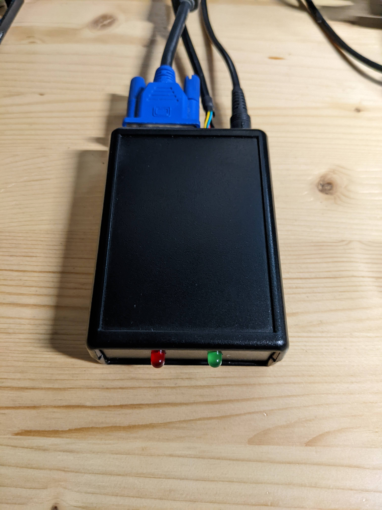
  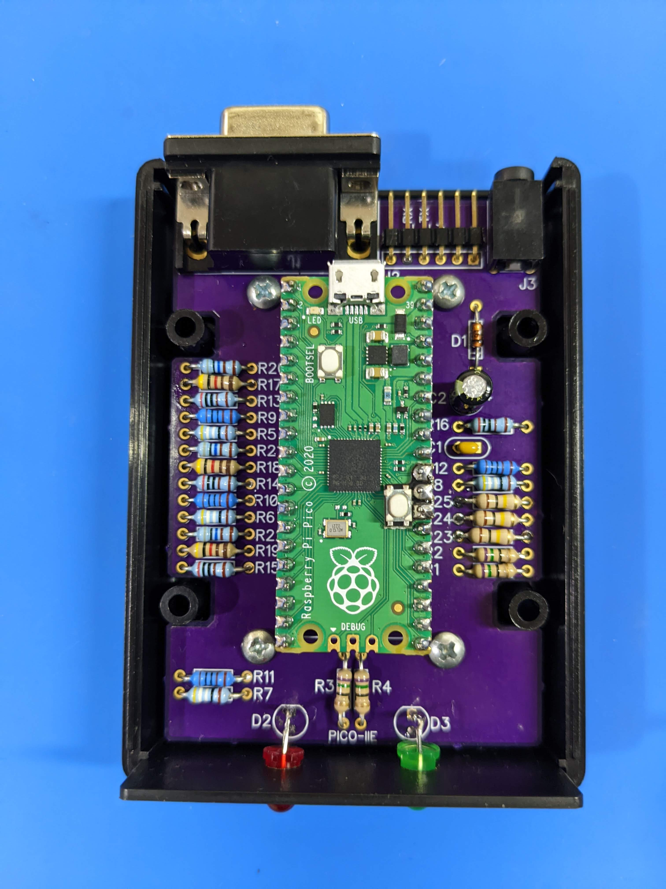
</p>


### Project History

This project started in 2020 after a failed attempt at installing an Apple II emulator on a Linux machine.
The most active project on github was LinApple (https://github.com/linappleii/linapple). I had some trouble compiling the project so I went looking for alternatives. I found some historical background on LinApple from the person who originally ported AppleWin over to Linux.
 (http://linapple.sourceforge.net/).  

Then I was able to find a fork of the sourceforge code. From the initial commit it looks like this started in 2012 (https://github.com/LasDesu/linapple.git). I was able to easily compile this version and get it running. This doesn't seem to be actively updated but I found the code simpler than the more active https://github.com/linappleii/linapple.

After looking at the source code for a while I understood a little about how it worked, but only at the most rudimentary level. The project was written in C++, but I couldn't find anything in the code that required C++ over C. I'm far more comfortable writing code in C so I was starting to wonder if it could just be in C. A lot of the modules were coupled together calling each others functions which made the conversion to C and understanding the code difficult.

I started playing with the code to see if I could accomplish a few things:
1. Simplify the code.
2. Remove features that I don't find useful.
3. Decouple all the modules.
4. Convert all the files to C.

At this point in 2020 I started what I called my deconstruction project. It basically was a process with two steps.
1. Remove a feature, simplify, or refactor some code.
2. Run a game and see if it still works.

This may sound like a tedious process, but it was super fun and gave me an excuse to try out Apple II games on a regular bases.

The original LinApple code uses 6502 emulation that executes a complete instruction every call as opposed to a per cycle emulator that executes one clock cycle per execution. This is one of the main reasons the code had so much coupling between modules. A per instruction emulation requires accessing RAM, ROM, and peripherals from the actual instruction. I looked around for a per cycle emulator. I found this project https://github.com/floooh/chips. It was surprisingly easy to integrate into the project. This allowed decoupling of all the other modules from the 6502 emulation. The trade off is that per cycle emulation is slower than per instruction emulation.

I ended up removing the SDL1 layer used in the project and used Pygame as the interface to the code just to test the C portion of the emulator. This simplified the C code but slowed down the project further. At this point the emulator code was cleaner but running slower than the original project. The other issue was with emulating sound on Pygame. I have not been able to update sound without glitching/clicking between updates. I'm not sure if this is an inherent problem with Pygame or just my lack of understanding.

I decide to try running the emulator on a microcontroller. After trying out a few processors I landed on using the Pi Pico.

The projects use both cores and is overclocked at 470MHz.

#### Core 0
- VGA scan line updating
- Getting video memeory from RAM
- Converting video memory for the scan line to data needed to display
- Serial UART operations:
    - keyboard
    - joystick
    - bin files
    - disk files

#### Core 1
- 6502
- RAM
- ROM
- Disk
- Keybaord
- Speaker
- Video
- Cassette (just output as a debug pin for getting timing information from programs running on emulator)

The emulator takes approximately 1 microsecond to complete a machine cycle and access peripherals.

### Development Hardware
The emulator runs on a Pi Pico using a Pimoroni Pico VGA Demo Base (https://shop.pimoroni.com/products/pimoroni-pico-vga-demo-base?variant=32369520672851) with a few modifications.

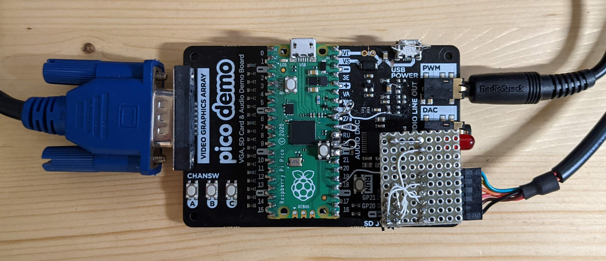

### Setup
The pico-iie requires 3 cables:
- USB to UART cable with 3.3V signals.
- A VGA cable
- An audio cable

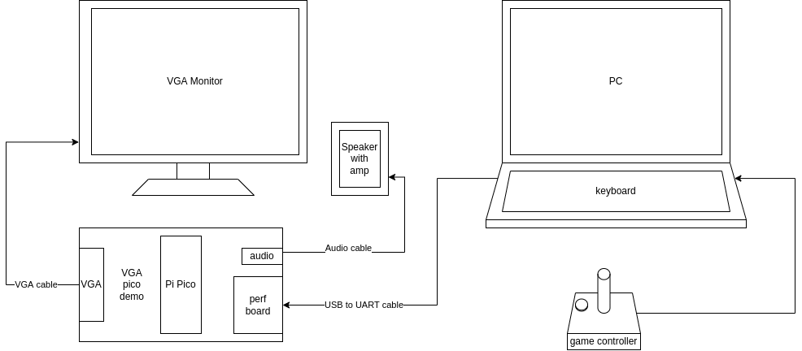

### Pico VGA Demo Board Modifications

The pico VGA Demo board requires 3 cut traces, 5 jumpers, and removal of some components

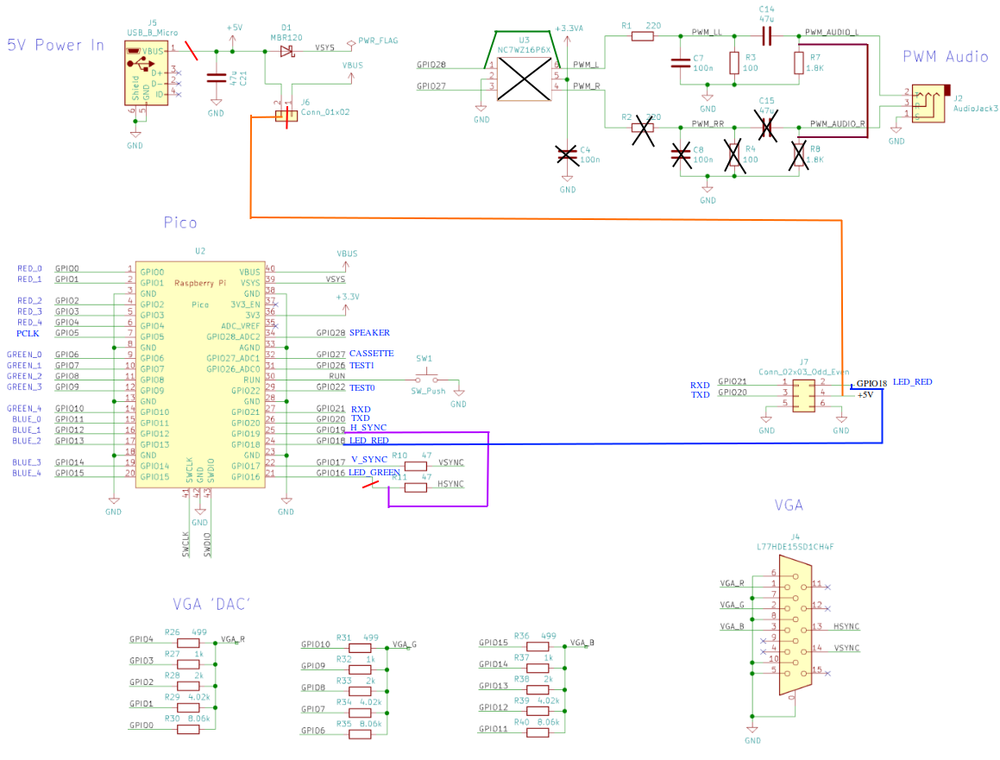

### Perf Board

The perf (perforated) board adds the red LED and the serial connector for the USB to UART cable. J1 of the perf board plugs into J7 on the Pico VGA Demo Board.

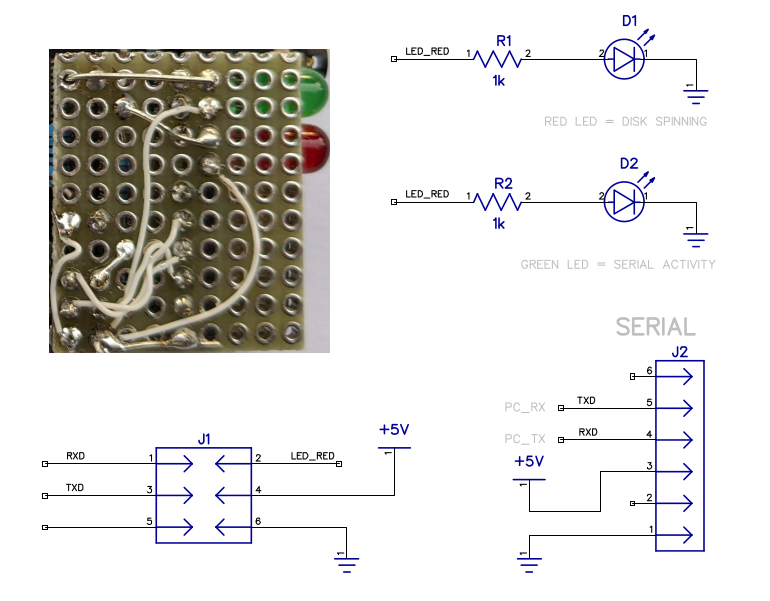


### Compiling and Downloading to Pi Pico

There are good resources on the web for compiling and downloading C Pi Pico projects. The short version of this after git clone(ing) this project and setting up the tool chain navigate to the ```build``` folder. In build folder:

```
export PICO_SDK_PATH=../../pico-sdk
cmake ..
make
```

To program through the Pi Pico USB connector hold the BOOTSEL pin and press RUN. After the USB drive shows up in your file browser drag the ```pico-iie.uf2``` file onto the drive icon.

At this point if everything is wired up correctly you should see the ```Apple //e``` text at the top of the VGA screen with the blinking prompt and the familiar beep can be heard. The pico-iie can be powered by the USB micro connector on the Pi Pico or the USB to UART cable 5V.

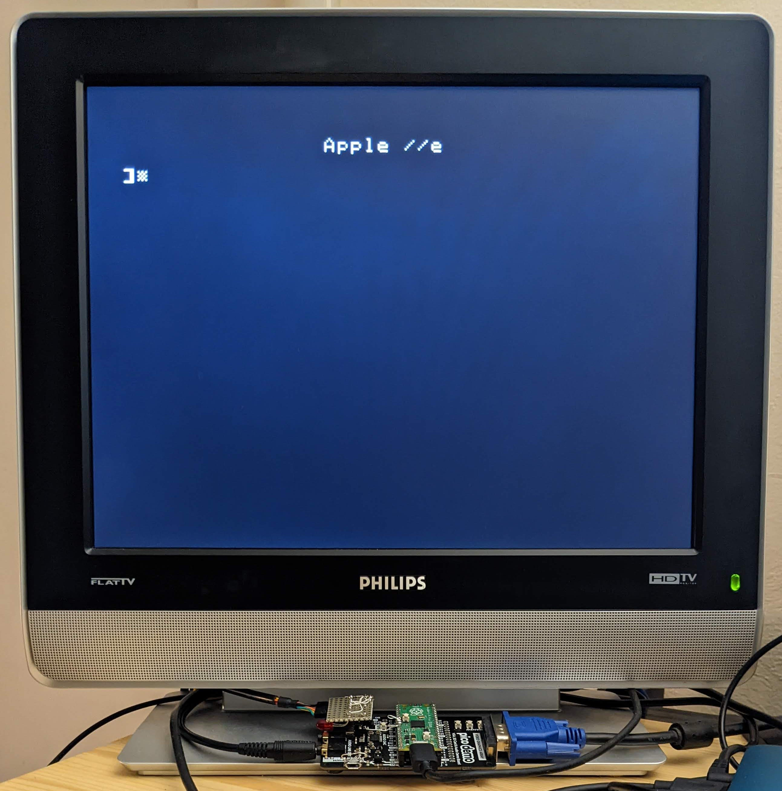

### main.py

Running ```main.py``` brings up a black pygame window (shown below). As long as the pygame window is in focus on the desktop, keyboard and game controller inputs are sent down to the pico-iie from your PC to the pi pico through the USB to UART cable as serial data.


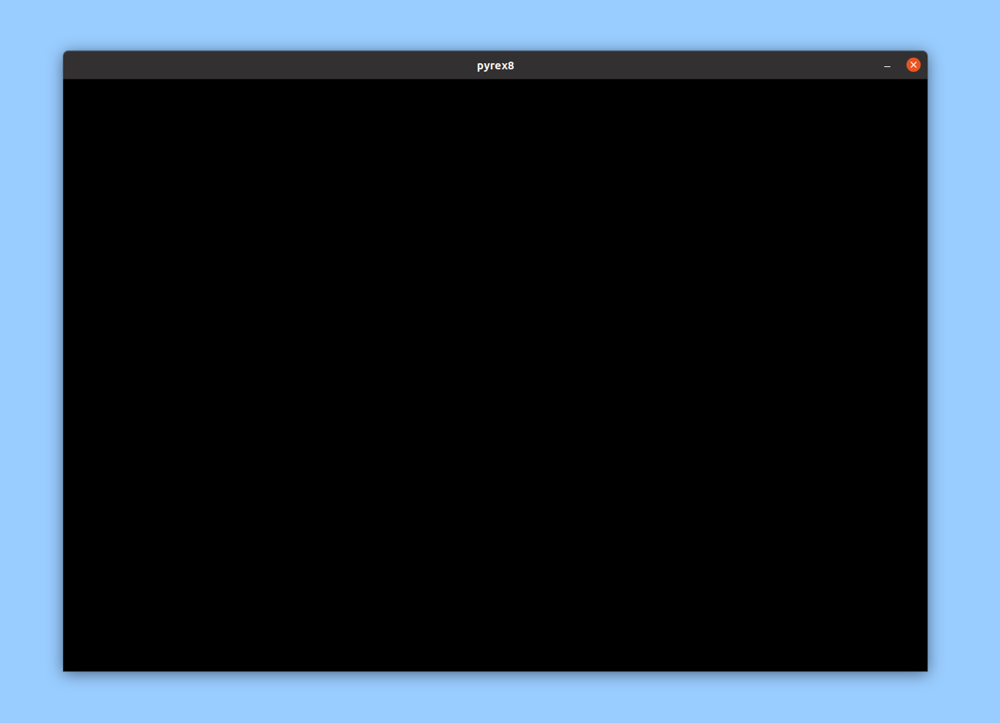

The disk is not automatically detected. By starting ```main.py``` communication starts between a Linux PC and the Pi Pico. If main.py is started with a .dsk file the emulator will automatically reboot with the dsk imag.

main.py can load a ```bin``` or ```dsk``` file.

If you use the menu command Download ROM image for Cosmic Impalas and save locally
https://8bitworkshop.com/v3.9.0/?file=cosmic.c&platform=apple2

You can download the bin file directly to the pico-iie though the USB to serial cable

```
python3 main.py cosmic.bin
```

The green LED on the pi pico turn on solid green for a few seconds as it downloads then the game will start automatically.

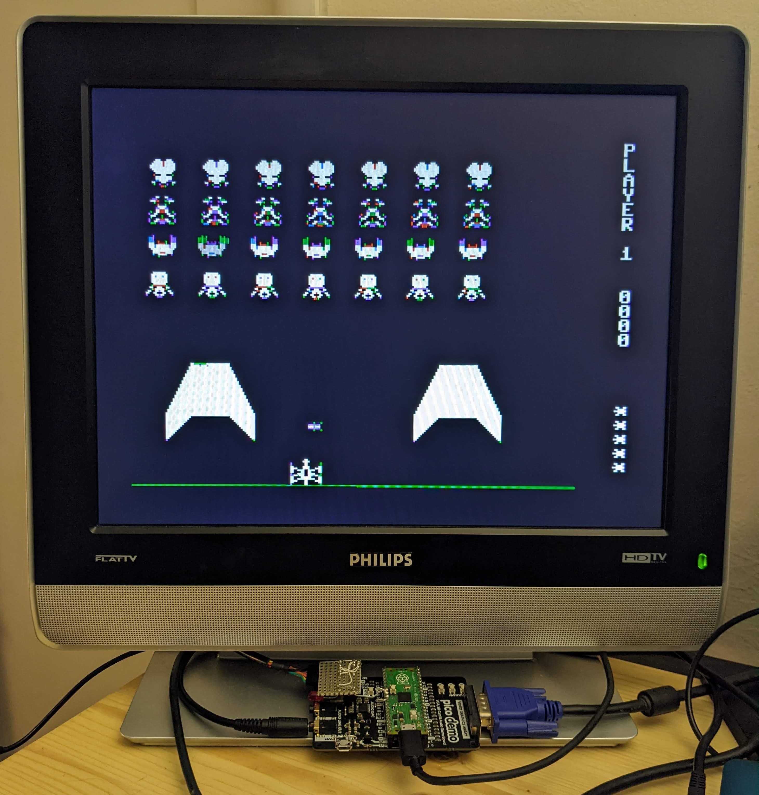

The red LED indicates Disk operation.

Example:
```
python3 main.py Choplifter.dsk
```

After the file is downloaded and running the main.py can be used for keyboard input and/or game controller input through the serial cable. This eliminates the need for direct connection to peripherals to the Pi Pico.

- F1 is used for breaking your program, the same as CRTL-C on the original machine.
- F2 key toggles pausing the emulator.
- F9 reboots
- F10 exits main.py program.

### Pi Pico Pinout Block Diagram

From the block diagram it can be seen that the peripherals use are:
- GPIO
- UART1
- PWM0, PWM1, PWM2
- PIO0
- DMA0, DMA1

VGA is data is produced using PIO0 as a 16 bit parallel port controlled by a circular DMA. The length of the buffer is equivalent to one VGA scan line. This would allow a similar implementation on other Microcontrollers.

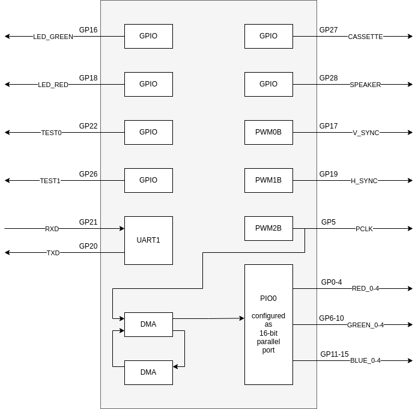

### Emulator Simplification

There are some simplifications/limitations to the emulator.

- Only emulates a 48K RAM.
- TEXT and HIRES modes only, no LORES mode.
- No blinking text, just NORMAL and INVERSE. FLASH displays as inverse and some odd characters.
- Most of the soft switch read "side affect" are not emulated.
- Vertical blanking register is not updated. This is due to it only being in the IIe so most games don't use it.
- Communication on UART is very rudamentary:
    - Only raw data is sent down with no error checking.
    - Data is only on direction so disk data is not saved back to PC.
    - bin files always load at 0x803. This is hard coded for now to be compatable with https://8bitworkshop.com Apple II generated bin files.

### PCB (WIP)

A dedicated PCB is in the works. The schematics is in Diptrace (https://diptrace.com/).

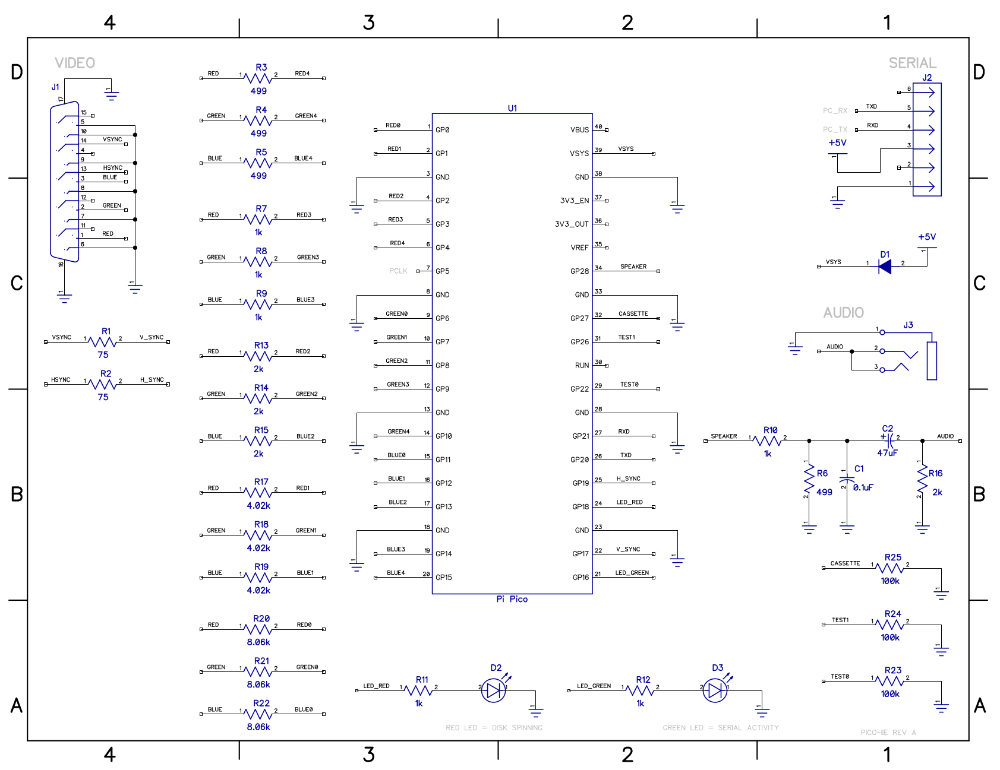


PCB is shared on OSH Park https://oshpark.com/shared_projects/atsJNRzd


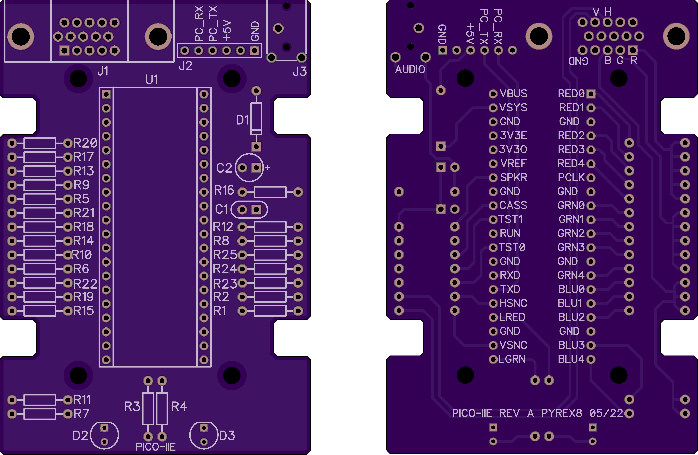

pico-iie pcb (Note: OSH Park requires 3 pcbs per order and price here is per pcb)

| # | Description           | Part Number | Price |
|---|-----------------------|-------------|-------|
| 1 | pico-iie rev a pyrex8 | pico-iie    |$12.03 |


PCB bill of Materials

| # | RefDes             |Description           | Part Number       | Price |
|---| ------------------ |--------------------- | ----------------- | ----- |
| 1 | U1                 | Header               |                   |       |
| 2 | J1                 | DB15F_HD             | AHDF15A-KG-TAXB   |$1.36  |
| 3|  J2                 |CONN HEADER R/A 40POS | PRPC040SBAN-M71RC |$0.83  |
| 4 | J3                 |STX-3000              | STX-3000          |$0.74  |
| 5 | D1                 |1N914                 |                   |       |
| 6 | D2                 | LED Red              |                   |       |
| 7 | D3                 | LED GREEN            |                   |       |
| 8 |C1                  | 0.1uF                |                   |       |
| 9 |C2                  | 47uF                 |                   |       |
| 11 |R5, R6, R7, R8     | 499                  |                   |       |
|10 | R1, R2, R3, R4     | 75                   |                   |       |
| 12 | R9, R10, R11, R12 | 1k                   |                   |       |
| 13 |R13, R14, R15, R16 | 2k                   |                   |       |
| 14 | R17, R18, R19     | 4.02k                |                   |       |
| 15 |R20, R21, R22      | 8.06k                |                   |       |
| 16 | R23, R24, R25     | 100k                 |                   |       |


Pi Pico

| # | Description              | Part Number | Price |
|---|--------------------------|-------------|-------|
| 1 | RASPBERRY PI PICO RP2040 | SC0915      | $4.00 |

The pcb is designed to fit in this case: http://www.hammondmfg.com/pdf/1593L.pdf

| # | Description                    | Part Number | Price |
|---|--------------------------------|-------------|-------|
| 1 |BOX ABS BLACK 3.631"L X 2.607"W | 1593LBK     | $5.24 |


Cables

| # | Description                | Part Number | Price |
|---|----------------------------|-------------|-------|
| 1 | CABLE USB UART 3.3V .1"HDR |             |$15.00 |
| 1 | VGA cable                  |             | $5.00 |
| 1 | 3.5mm Audio cable          |             | $3.00 |
